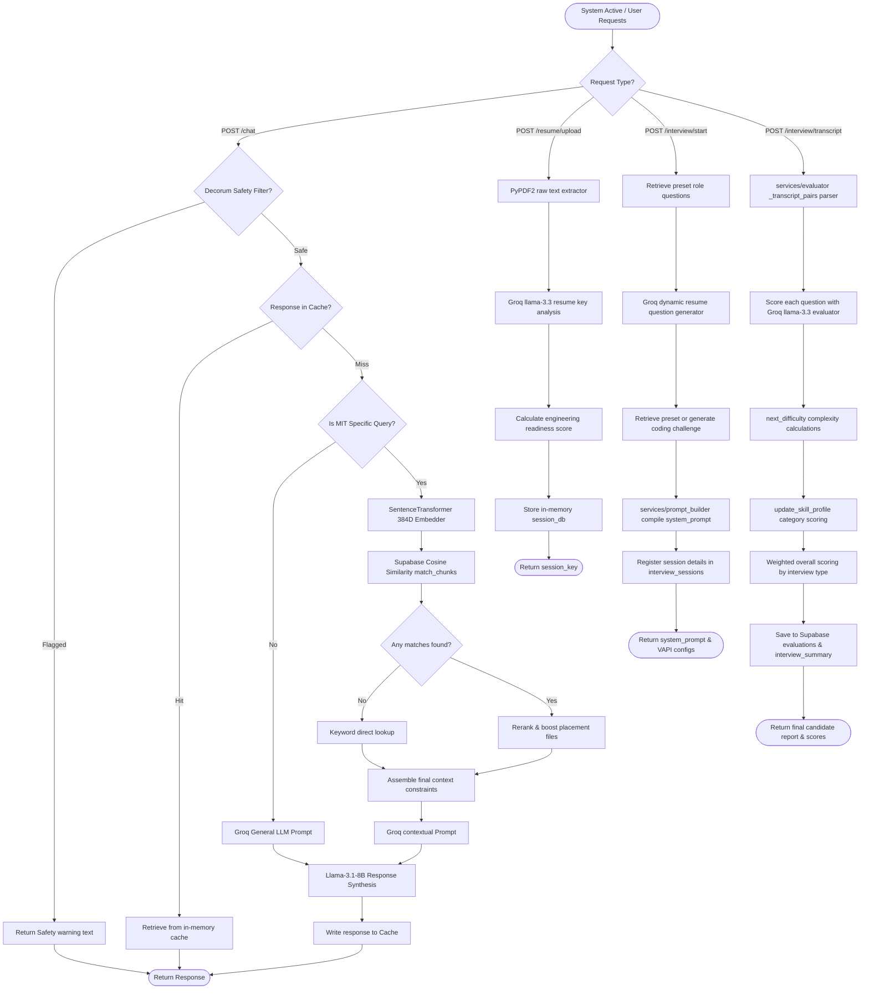
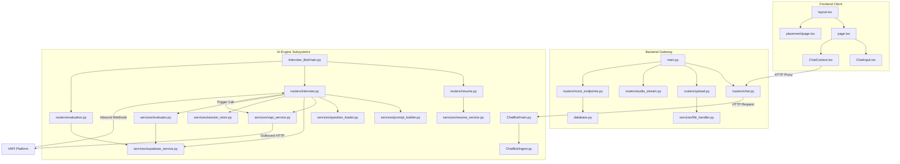

# System Execution Flowcharts & Diagrams 📊

This document provides visual models of the Manipal Campus Assistant execution flows, module dependencies, and structural data transformations.

---

## 1. End-to-End Execution Flowchart

This Mermaid flowchart visualizes the operations of both the **RAG Chatbot** and the **Interview Bot** during runtime execution, outlining decision splits and database updates.



---

## 2. Module Dependency Diagram

This diagram displays how directories, files, and modules import and call each other.



---

## 3. Detailed Data Flow Transformations

The table below maps the exact inputs, intermediate data structures, and outputs that traverse the AI engine boundaries.

### RAG Chatbot Data Flow

```text
User Query (string)
  ↓
Decorum Safety Filter (Regex/String check)
  ↓
Smart Routing Check (Intent Classification Dictionary)
  ↓
SentenceTransformer (CPU processing -> 384-dimensional List[float])
  ↓
Supabase RPC match_chunks (List[float] -> List[Dict] with similarity scores)
  ↓
Reranker / Placement Booster (List[Dict] -> Sorted List[Dict])
  ↓
Context Constructor (Sorted List[Dict] -> String Context Block)
  ↓
Groq Completion (String Context + User Query -> JSON / String Output)
  ↓
Response Cache (String Output -> Saved Cache Dictionary)
```

### AI Interview Bot Data Flow

| Stage | Input Data Structure | Processing Module | Output Data Structure |
| :--- | :--- | :--- | :--- |
| **PDF Extraction** | Raw PDF File stream | `PyPDF2.PdfReader` | Cleaned raw string text (`resume_text`) |
| **Resume Analysis** | `resume_text` (str) | `analyse_resume` (Groq API) | JSON Object holding parsed candidate profile |
| **Readiness Check** | Candidate profile (JSON) | `calculate_readiness` | Score (int) and matched benchmark tags (dict) |
| **Questions Setup**| Candidate profile + Role | `generate_resume_questions` | List[Dict] (5 resume questions with ID and difficulty) |
| **Prompt Synthesis**| Questions + Role + Profile | `build_prompt` (Prompt Builder)| Detailed Vapi system prompt string |
| **Transcript Ingestion** | VAPI message body (JSON) | `/interview/transcript` | List[Dict] (ordered message blocks with role/message) |
| **Answer Extraction** | List[Dict] (Messages) | `extract_answer_from_transcript` | Cleaned user answer string |
| **Evaluation** | Question (str) + Answer (str)| `_groq_evaluate` (Groq API) | Score (0-10) and qualitative feedback (JSON) |
| **Summary Score** | Question evaluation list | `generate_summary` | Overall score (0-100), weaknesses, skill metrics (JSON) |
