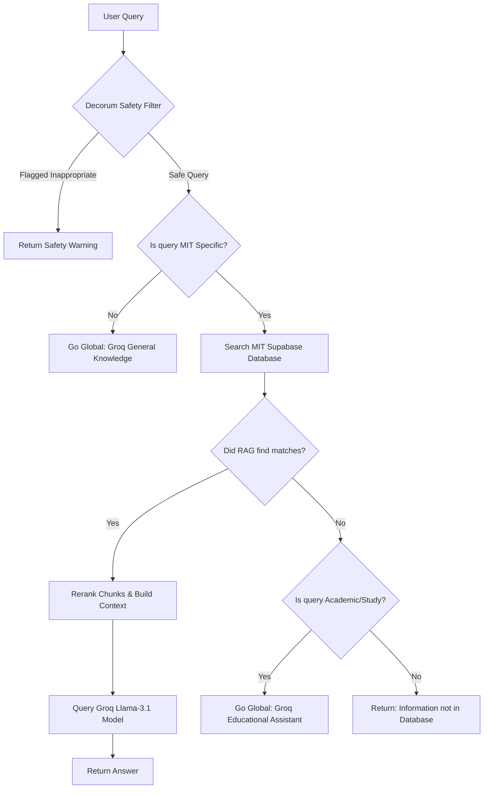

# MIT Bengaluru RAG Chatbot API

Welcome to the **MIT Bengaluru RAG Chatbot**! This is a state-of-the-art, cloud-portable Retrieval-Augmented Generation (RAG) backend. It leverages **Supabase** for hybrid vector and text search, and **Groq** for high-speed LLM generation. 

The chatbot is designed to run completely stateless, making it suitable for deployment on any cloud provider (e.g., Hugging Face Spaces, AWS, GCP, Vercel) without relying on local DB files.

---

## 🏗️ System Architecture & How It Works

The chatbot uses a **Hybrid Search & Smart Routing** architecture to answer questions:



### Core Features:
1.  **Decorum & Safety Interceptor:** Automatically filters inappropriate, sexual, or vulgar queries before they hit the database or LLM.
2.  **Smart Routing:** Determines if a query is college-specific or general knowledge. General queries bypass the database to save resource overhead.
3.  **Multi-Format Ingestion:** Supports uploading and parsing `.txt`, `.pdf`, `.docx`, `.csv`, `.xlsx`, `.db`, and `.json` files.
4.  **Hybrid Reranking:** Blends vector search results and keyword text matches, prioritizing exact matches and semantic relevance.
5.  **Proximity & Key-Value Parsing:** Intelligently parses tabular data and structured key-value listings (like CSVs/Excel rows) to pull exact student and placement details.

---

## 🤖 Models Used

*   **Embedding Model:** `all-MiniLM-L6-v2` (SentenceTransformer)
    *   *Purpose:* Generates 384-dimensional vector embeddings locally on the CPU. It is extremely fast and lightweight.
*   **LLM Model:** `llama-3.1-8b-instant` (via Groq API)
    *   *Purpose:* Synthesizes and generates the final natural language answer based on the retrieved context. It runs with low latency (~0.5s - 0.7s response time).

---

## 🔌 API Endpoints & Working

The FastAPI backend exposes the following **4 main endpoints**:

### 1. `POST /chat`
*   **Description:** The primary chat endpoint for querying the chatbot.
*   **How it works:** 
    *   It checks the rate limit and looks up the query cache (responses are cached for 10 minutes).
    *   Runs the Decorum Safety Filter.
    *   Determines if the query is MIT-specific. If so, it queries the Supabase database.
    *   Reranks the retrieved chunks, builds the prompt context, and sends it to the Groq LLM to generate the final response.
*   **Request Body:**
    ```json
    {
      "question": "What is the attendance policy at MIT Bengaluru?"
    }
    ```

### 2. `POST /upload`
*   **Description:** Uploads a document to Supabase and automatically ingests it.
*   **How it works:**
    *   Saves the uploaded file temporarily.
    *   Parses the file content according to its extension.
    *   Generates semantic vector embeddings for the extracted text chunks.
    *   Clears any old database records associated with the file name to prevent duplicate chunks.
    *   Uploads the new vector chunks to the `mit_bengaluru_data` table in Supabase.
    *   Uploads the raw document file to the `chatbot-assets` Supabase Storage bucket.
    *   Triggers an in-memory memory reload so the new data is active immediately without restarting.

### 3. `DELETE /delete`
*   **Description:** Deletes an ingested document from both storage and database.
*   **How it works:**
    *   Deletes all chunk rows in the `mit_bengaluru_data` database table belonging to the specified file name.
    *   Removes the raw file from the `chatbot-assets` storage bucket.
    *   Triggers an in-memory cache reload to remove the deleted data from the chatbot's active memory.
*   **Parameters:** `filename` (Query string, e.g., `/delete?filename=sample_placements.csv`)

### 4. `GET /files`
*   **Description:** Lists all raw document files stored in the knowledge base.
*   **How it works:**
    *   Connects to the `chatbot-assets` storage bucket in Supabase using the service_role key to bypass storage policies.
    *   Returns a JSON list of all stored files, including their sizes and creation timestamps.

---

## 🛠️ Step-by-Step Installation & Setup

### STEP 1: Install Dependencies
Ensure you have Python 3.8+ installed. Run the following command in your terminal:
```bash
pip install -r requirements.txt
```

### STEP 2: Set Up Supabase Database & Stored Procedures
1.  Go to your [Supabase Dashboard](https://supabase.com) and select/create a project.
2.  Click on **SQL Editor** in the left sidebar $\rightarrow$ click **New Query**.
3.  Paste the following SQL script and click **Run**:

```sql
-- 1. Enable pgvector
create extension if not exists vector;

-- 2. Create the unified hybrid data table
create table if not exists mit_bengaluru_data (
  id text primary key,
  title text,
  knowledge_type text,
  url text,
  content text,
  embedding vector(384),
  metadata jsonb
);

-- 3. Create a stored procedure (RPC) for semantic search
create or replace function match_chunks (
  query_embedding vector(384),
  match_threshold float,
  match_count int
)
returns table (
  id text,
  title text,
  knowledge_type text,
  url text,
  content text,
  similarity float
)
language sql stable
as $$
  select
    mit_bengaluru_data.id,
    mit_bengaluru_data.title,
    mit_bengaluru_data.knowledge_type,
    mit_bengaluru_data.url,
    mit_bengaluru_data.content,
    1 - (mit_bengaluru_data.embedding <=> query_embedding) as similarity
  from mit_bengaluru_data
  where 1 - (mit_bengaluru_data.embedding <=> query_embedding) > match_threshold
  order by mit_bengaluru_data.embedding <=> query_embedding
  limit match_count;
$$;
```

### STEP 3: Set Up Supabase Storage Bucket
1.  Click on the **Storage** tab in the left sidebar on your Supabase dashboard.
2.  Click **New Bucket**.
3.  Name the bucket exactly **`chatbot-assets`**.
4.  Toggle the bucket to **Public**, and click **Save**.

### STEP 4: Configure Database Roles & Permissions
Paste and execute the following SQL commands in the SQL Editor to grant the API roles access to your database table:
```sql
grant select on public.mit_bengaluru_data to anon;
grant select on public.mit_bengaluru_data to authenticated;
grant all on public.mit_bengaluru_data to service_role;
```

> [!IMPORTANT]
> These grants allow the public `anon` client to run vector searches and read data, while restricting write/delete operations to the secure `service_role` client.

### STEP 5: Create and Configure Environment Variables
1.  If you do not have a Supabase project yet, sign up on [supabase.com](https://supabase.com), organizations organize and click **New Project**. Fill in the database password and organizational details, then pick the organization and region closest to your hosting server.
2.  Go to **Settings** (Gear Icon) $\rightarrow$ **API** on your Supabase Dashboard to find your keys.
3.  Create a file named `.env` in the root of the project and fill in the credentials:
```env
# Supabase Configuration
SUPABASE_URL=https://your-project-id.supabase.co
SUPABASE_SERVICE_KEY=your-supabase-service-role-key-here
SUPABASE_ANON_KEY=your-supabase-anon-key-here

# Groq LLM Configuration
GROQ_API_KEY=your-groq-api-key-here
CHATBOT_ALLOWED_ORIGINS=*
```

---

## 🚀 Running the Application

### 1. Ingest Initial Data (Optional)
If you have a local `dataset.json` in the root folder, ingest it into the cloud database using:
```bash
python ingest.py
```

### 2. Start the API Server
Run the FastAPI application locally using Uvicorn:
```bash
python -m uvicorn main:app --reload
```
Once started, the API Documentation (Swagger UI) is available at: **`http://127.0.0.1:8000/docs`**.
